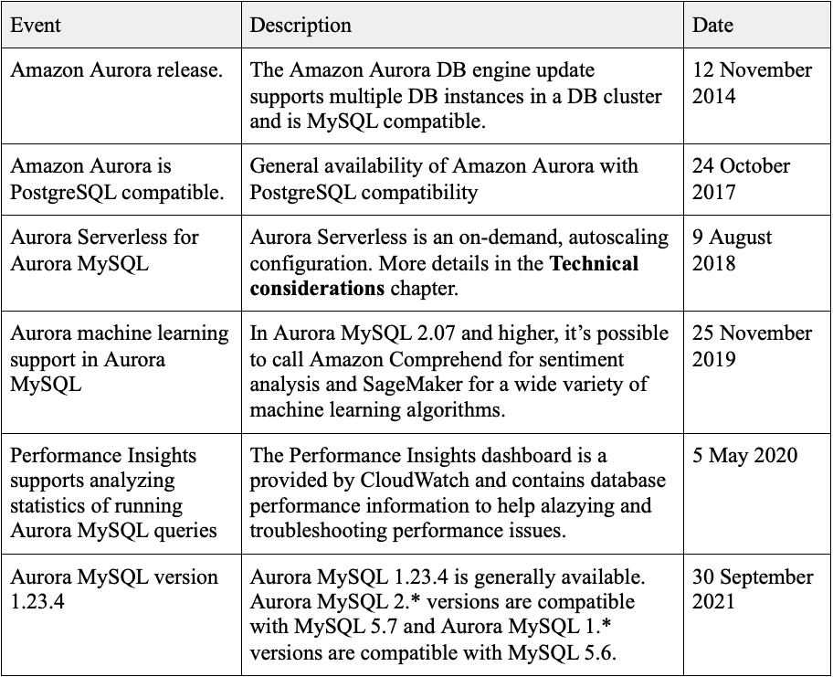

# ADB - Assignment A: Amazon Aurora DB
## What is Amazon Aurora DB ?
Amazon Aurora DB is an enterprise relational database engine compatible with MySQL and PostgreSQL. Aurora is provided by AWS (Amazon Web Services) through the Amazon Relational Database Service (RDS) which is a managed service that offers databases in the cloud. With RDS customers transfer the responsibility of maintaining the database underline infrastructure to Amazon, but also assumes the responsibility of their security in the cloud, customer data, applications, platforms, operation systems and server side data encryption. Aurora is ultimately a new version of AWS RDS. The engineering behind Aurora is a unique approach that was recognized and awarded in THE 2019 SIGMOD Systems Award where the project developers received the award for fundamentally redesigning a relational database storage for cloud environments.

## Deploying a Aurora DB instance with Mysql

### Requirements

Before you proceed, please make sure you have completed all this tasks below in your Laptop/Desktop, feel free to raise any question as an [issue](#issue) in this repository, I will be happy to answer them. 


### Architecture
We are going to use the minimal recommended configuration to deploy an RDS in AWS in a safe mner, and please remember that deploying a Database with public access to the internet is not recommended, it's considered a serious security flaw, the recommended way to expose your database is limiting the endpoint access to consumers inside your VPC, to be able to connect to the database we are going to create an EC2 instance with public access to the internet that will work as a bastion instance. 

Deploying all these resources manually can be tricky, and after completing this demonstration you may want to destroy the entire environment without the need to pick manually resources that you have created before just to avoid undesired charges, for these reasons we are going to use Terraform. Let's define a resource called aws\_db\_instance and name it "default", feel free to go straight tot the [main.tf](terraform/main.tf) and deploy your detabase if you already know how the define the AWS resources in Terraform, if you are just getting started, not problem at all, we will approach each step until you are able to connect to your database in the Cloud. 


Now let's deploy the resources using terraform:
```bash
$ cd terraform
$ terraform apply 
var.db_password
  Enter a value: "MySQL Password"

var.db_user_name
  Enter a value: "MySQL User"

var.instance_key_name
  Enter a value: "Your AWS instance key name"
  ```

You need to confirm with "yes" and Terraform will create the resource in your AWS account. The whole process can take up to 4 minutes, let's use this time learn a little bit more about Aurora DB in our next session. 

### A little bit more about AWS Aurora DB



